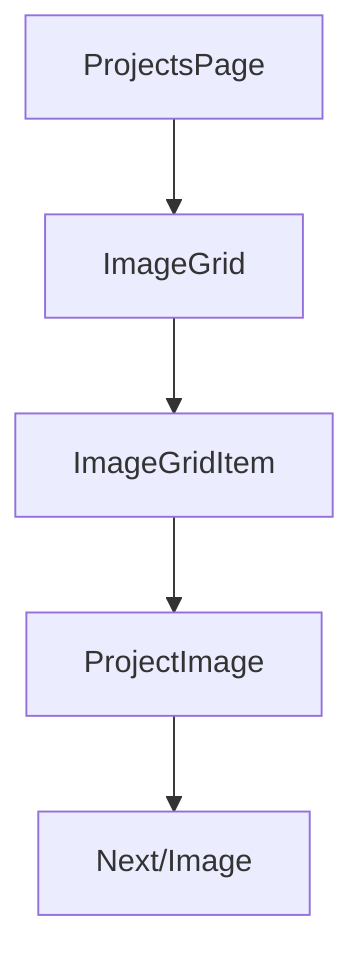
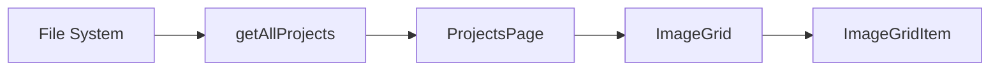

# Image Grid Implementation Plan

## System Analysis

### Current Implementation
The codebase currently has several relevant components:
- `ProjectImage` component for optimized image rendering
- Basic grid implementation in `projects/page.tsx`
- Image loading and data management in `lib/data.ts`
- Project type definitions and interfaces

### Required Changes

#### 1. Component Structure


#### 2. Data Flow


## Implementation Roadmap

### Phase 1: Core Components

1. Create new components:
   - `ImageGrid`: Manages the 2-1-2-1 layout pattern
   - `ImageGridItem`: Handles hover states and image transitions

2. Update data structure:
   ```typescript
   interface ProjectImage {
     id: string;
     primaryImage: {
       src: string;
       alt: string;
     };
     secondaryImage: {
       src: string;
       alt: string;
     };
   }
   ```

### Phase 2: Layout Implementation

1. Grid Pattern Algorithm:
   ```typescript
   const calculateLayout = (index: number) => {
     const position = index % 6; // Complete pattern is 6 images (2-1-2-1)
     return {
       isFullWidth: position === 2 || position === 5,
       gridColumn: getGridColumn(position)
     };
   };
   ```

2. Responsive Design:
   - Mobile: Single column
   - Tablet: Maintain pattern with adjusted sizes
   - Desktop: Full pattern implementation

### Phase 3: Interaction Implementation

1. Hover Effect:
   - CSS transitions for smooth image swaps
   - Touch event handling for mobile
   - Loading state management

2. Performance Optimizations:
   - Lazy loading implementation
   - Image optimization settings
   - Placeholder strategy

## Step-by-Step Tasks

### 1. Component Setup (Day 1)

1. Create `components/image-grid/`:
   ```
   image-grid/
   ├── ImageGrid.tsx
   ├── ImageGridItem.tsx
   ├── types.ts
   └── utils.ts
   ```

2. Implement base components:
   - [ ] Create ImageGrid component with grid layout
   - [ ] Create ImageGridItem with basic structure
   - [ ] Define shared types and utilities

### 2. Layout Implementation (Day 1-2)

1. Grid Pattern:
   - [ ] Implement grid container with Tailwind
   - [ ] Create layout calculation utilities
   - [ ] Add responsive breakpoints

2. Image Container:
   - [ ] Set up aspect ratio containers
   - [ ] Implement image loading states
   - [ ] Add placeholder components

### 3. Hover Functionality (Day 2-3)

1. Image Transitions:
   - [ ] Add hover state management
   - [ ] Implement smooth transitions
   - [ ] Create loading states

2. Mobile Support:
   - [ ] Add touch event handlers
   - [ ] Implement tap-to-toggle
   - [ ] Test on various devices

### 4. Performance Optimization (Day 3-4)

1. Image Loading:
   - [ ] Configure lazy loading
   - [ ] Implement loading priority
   - [ ] Add blur placeholders

2. Performance Metrics:
   - [ ] Set up performance monitoring
   - [ ] Optimize CLS prevention
   - [ ] Test loading scenarios

### 5. Testing & QA (Day 4-5)

1. Component Testing:
   - [ ] Write unit tests for layout logic
   - [ ] Test hover interactions
   - [ ] Verify mobile functionality

2. Integration Testing:
   - [ ] Test with real project data
   - [ ] Verify responsive behavior
   - [ ] Check performance metrics

### 6. Final Polish (Day 5-6)

1. Refinements:
   - [ ] Add loading animations
   - [ ] Implement error states
   - [ ] Add accessibility features

2. Documentation:
   - [ ] Update component documentation
   - [ ] Add usage examples
   - [ ] Document performance considerations

## Technical Specifications

### Grid Layout Classes
```typescript
const gridClasses = {
  container: "grid grid-cols-1 md:grid-cols-2 lg:grid-cols-4 gap-4",
  fullWidth: "col-span-full md:col-span-2",
  halfWidth: "col-span-1",
};
```

### Animation Timing
```typescript
const transitions = {
  hover: "transition-all duration-300 ease-in-out",
  loading: "transition-opacity duration-200",
};
```

### Breakpoints
```typescript
const breakpoints = {
  mobile: "320px",
  tablet: "768px",
  desktop: "1024px",
};
```

## Performance Targets

1. Loading Metrics:
   - FCP: < 1.5s
   - LCP: < 2.5s
   - CLS: < 0.1

2. Animation Performance:
   - 60fps transitions
   - No layout shifts during hover
   - Smooth mobile interactions

## Risk Mitigation

1. Image Loading:
   - Implement progressive loading
   - Use blur placeholders
   - Optimize image delivery

2. Mobile Performance:
   - Reduce animation complexity
   - Optimize touch handling
   - Test on low-end devices

3. Layout Shifts:
   - Pre-calculate image dimensions
   - Use aspect ratio boxes
   - Implement placeholder strategy

## Success Criteria

1. Visual:
   - Correct 2-1-2-1 pattern
   - Smooth hover transitions
   - Responsive behavior

2. Technical:
   - Meets performance targets
   - No layout shifts
   - Accessible implementation

3. User Experience:
   - Intuitive interactions
   - Fast loading times
   - Smooth mobile experience 