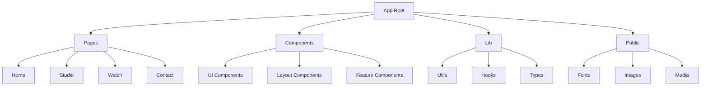
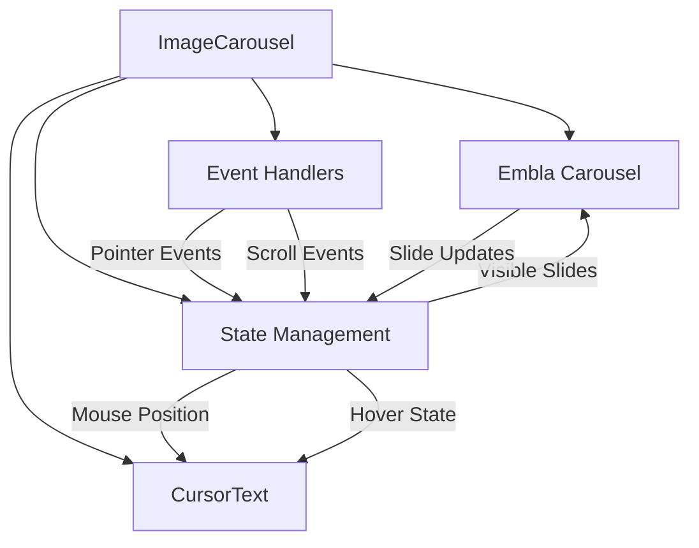
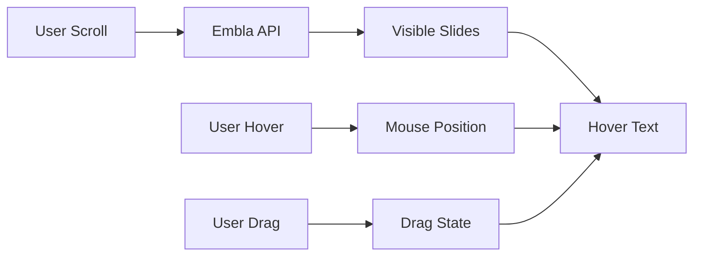
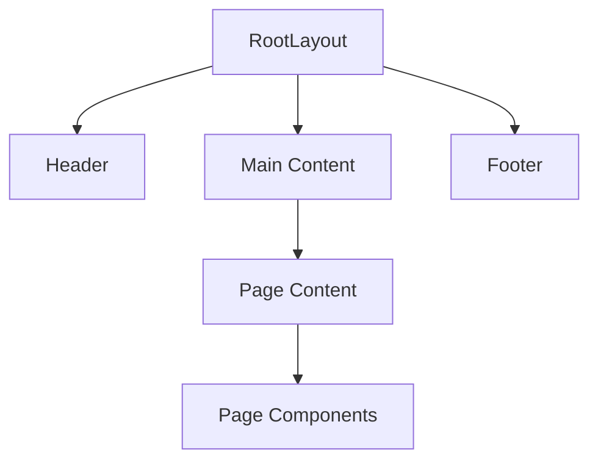
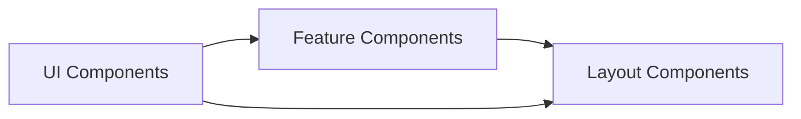
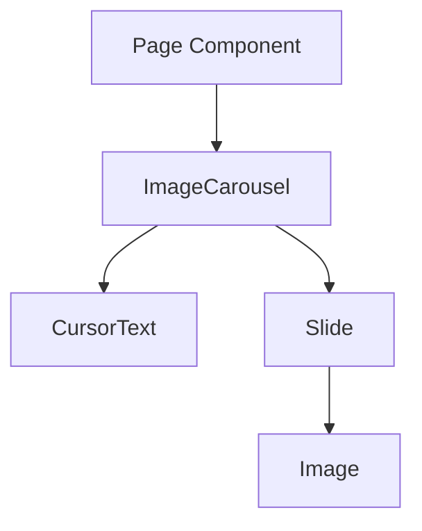
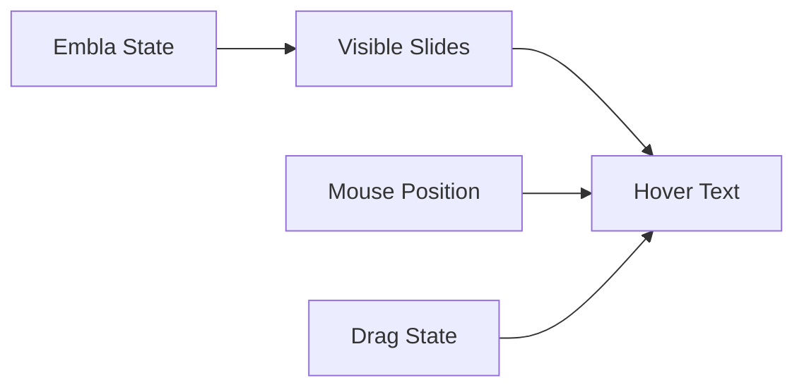
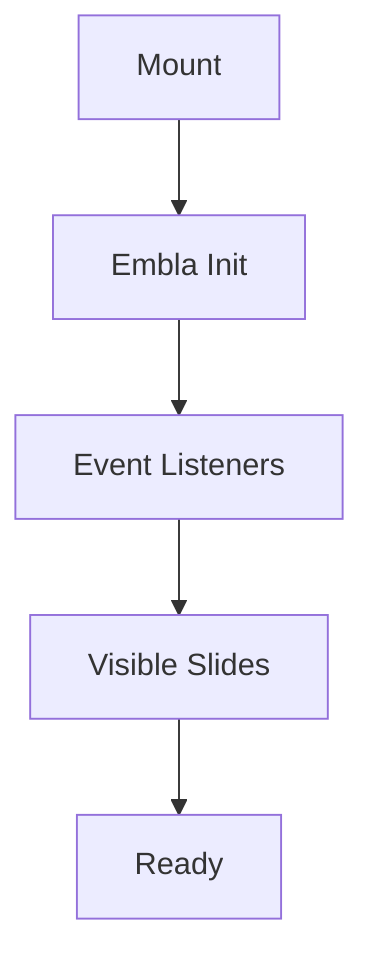
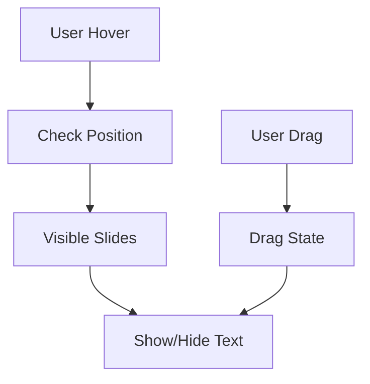
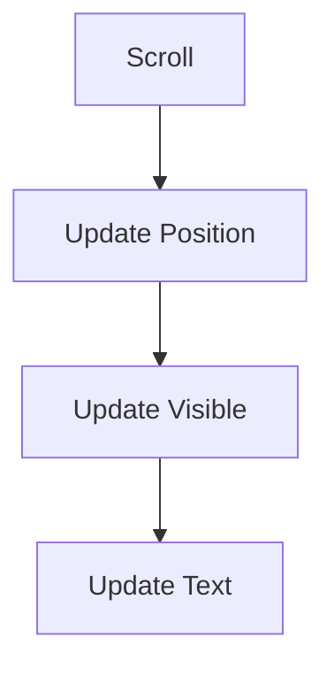

# System Patterns

## Architecture Overview

### Application Structure


### Component Architecture


### Data Flow


## Key Technical Decisions

### 1. Framework & Routing
- Next.js App Router for server-side rendering and routing
- TypeScript for type safety and better developer experience
- File-based routing structure in `src/app` directory

### 2. Component Architecture
- Atomic design pattern for UI components
- Server components by default, client components when needed
- Shadcn UI for base component library
- Custom components extend Shadcn UI base

### 3. Styling Strategy
- Tailwind CSS for utility-first styling
- CSS variables for theme customization
- CSS Modules for component-specific styles
- Custom Tailwind plugins for extended functionality

### 4. State Management
- React hooks for local state
- Server components for data fetching
- URL state for shareable UI state
- Context API for theme/global state

### 5. Animation System
- Framer Motion for complex animations
- CSS transitions for simple animations
- Intersection Observer for scroll-based animations
- Tailwind for basic hover/transition effects

### 1. Carousel Implementation
```typescript
// Direct Embla Carousel integration
const [emblaRef, emblaApi] = useEmblaCarousel({
    align: 'start',
    loop: true,
    slidesToScroll: 1,
    containScroll: 'keepSnaps',
    dragFree: false,
});
```

### 2. State Management
```typescript
// Core state management
const [mousePosition, setMousePosition] = useState({ x: 0, y: 0 });
const [hoveredImage, setHoveredImage] = useState<'prev' | 'next' | null>(null);
const [visibleSlides, setVisibleSlides] = useState<number[]>([]);
const [isDragging, setIsDragging] = useState(false);
```

### 3. Event Handling
```typescript
// Event management pattern
useEffect(() => {
    if (!emblaApi) return;
    
    const handlers = {
        select: () => setVisibleSlides(emblaApi.slidesInView()),
        pointerDown: () => {
            setIsDragging(true);
            setHoveredImage(null);
        },
        pointerUp: () => setIsDragging(false),
    };
    
    // Setup and cleanup
    Object.entries(handlers).forEach(([event, handler]) => {
        emblaApi.on(event, handler);
    });
    
    return () => {
        Object.entries(handlers).forEach(([event, handler]) => {
            emblaApi.off(event, handler);
        });
    };
}, [emblaApi]);
```

## Design Patterns

### 1. Component Patterns
```typescript
// Base Component Pattern
interface ComponentProps {
  children?: React.ReactNode;
  className?: string;
  // Additional props
}

function Component({ children, className, ...props }: ComponentProps) {
  return (
    <div className={cn("base-styles", className)} {...props}>
      {children}
    </div>
  );
}
```

### 2. Layout Patterns
```typescript
// Page Layout Pattern
interface PageLayoutProps {
  children: React.ReactNode;
}

function PageLayout({ children }: PageLayoutProps) {
  return (
    <>
      <Header />
      <main>{children}</main>
      <Footer />
    </>
  );
}
```

### 3. Animation Patterns
```typescript
// Framer Motion Pattern
const motionVariants = {
  hidden: { opacity: 0, y: 20 },
  visible: { opacity: 1, y: 0 }
};

function AnimatedComponent() {
  return (
    <motion.div
      variants={motionVariants}
      initial="hidden"
      animate="visible"
    >
      {/* Content */}
    </motion.div>
  );
}
```

### 1. Component Composition
```typescript
// Main component with subcomponents
export default function ImageCarousel() {
    // State and refs
    
    return (
        <div className="relative w-full">
            <div ref={emblaRef}>
                {/* Carousel content */}
            </div>
            <CursorText {...cursorProps} />
        </div>
    );
}
```

### 2. Responsive Design
```typescript
// CSS-based responsive layout
const slideStyles = {
    mobile: 'flex-[0_0_100%]',
    desktop: 'md:flex-[0_0_33.333%]',
    common: 'pl-4 min-w-0',
};

// Usage
<div className={`${slideStyles.common} ${slideStyles.mobile} ${slideStyles.desktop}`}>
    {/* Slide content */}
</div>
```

### 3. Image Management
```typescript
// Image duplication for smooth looping
const originalImages = [/* image paths */];
const images = [...originalImages, ...originalImages];

// Image rendering with optimization
<Image
    src={src}
    alt={`Carousel image ${(index % originalImages.length) + 1}`}
    fill
    className="object-cover"
    priority={index < 3}
/>
```

## Component Relationships

### 1. Layout Hierarchy


### 2. Component Dependencies


### 1. Parent-Child Structure


### 2. State Dependencies


## Critical Implementation Paths

### 1. Page Loading Sequence
1. Initial HTML from server
2. Font loading and application
3. Critical CSS injection
4. Hydration of client components
5. Animation initialization

### 2. Navigation Flow
1. Link interaction
2. Route change initiation
3. Page transition animation
4. New page content load
5. Component mount sequence

### 3. Animation Pipeline
1. Component mount
2. Initial animation state
3. Animation trigger
4. Transition execution
5. Completion/cleanup

### 1. Initialization Flow


### 2. Interaction Flow


### 3. Update Flow


## Performance Patterns

### 1. Image Optimization
- Next.js Image component usage
- Responsive image sizing
- Lazy loading implementation
- Format optimization (WebP)

### 2. Component Loading
- Dynamic imports for large components
- Suspense boundaries for loading states
- Progressive enhancement
- Code splitting strategies

### 3. Animation Performance
- GPU-accelerated properties
- RAF-based animations
- Debounced event handlers
- Optimized motion values

# Carousel System Patterns

## Architecture Overview
The carousel is designed as a self-contained, reusable component following modern web development practices.

## Component Structure
```
Carousel/
├── CarouselContainer (Main component)
│   ├── Navigation Controls
│   │   ├── PrevButton ("PREV" text)
│   │   └── NextButton ("NEXT" text)
│   ├── SlideContainer
│   │   └── Slides
│   └── Indicators (optional)
```

## Design Patterns

### 1. Container Pattern
- Main carousel container manages state and logic
- Child components are presentational
- Clear separation of concerns

### 2. State Management
- Controlled component pattern
- Single source of truth for slide state
- Predictable state updates

### 3. Event Handling
- Centralized event management
- Debounced event handlers where appropriate
- Touch event abstraction

### 4. Accessibility Pattern
- ARIA roles and labels
- Keyboard navigation support
- Focus management

## Component Relationships
1. CarouselContainer
   - Manages overall state
   - Coordinates between sub-components
   - Handles keyboard events

2. Navigation Controls
   - Pure components
   - Emit click events
   - Maintain own hover/active states

3. SlideContainer
   - Manages slide transitions
   - Handles touch events
   - Controls slide visibility

## Technical Decisions
1. Text-based navigation instead of icons
2. CSS transitions for smooth animations
3. Responsive design using flexible units
4. Touch events for mobile support

## Implementation Guidelines
1. Keep state management simple and predictable
2. Use semantic HTML elements
3. Implement proper accessibility patterns
4. Maintain clean separation of concerns
5. Document all public APIs and props

## Performance Considerations
1. Optimize transition animations
2. Lazy load non-visible slides
3. Minimize DOM updates
4. Use CSS transforms for animations

This document serves as a technical reference for maintaining consistency in implementation patterns and architectural decisions.
