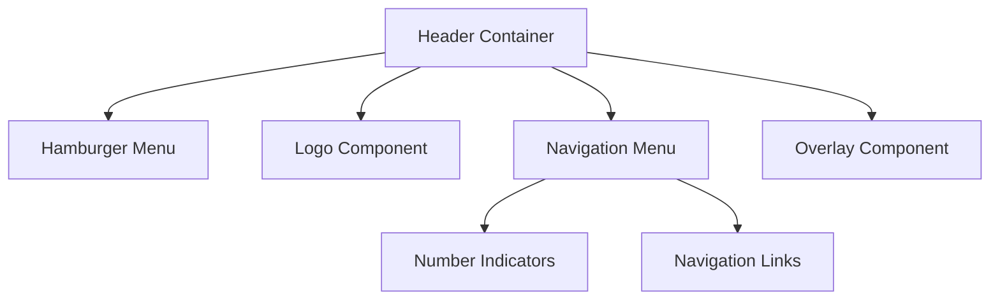

# System Patterns

## Architecture Overview

### Component Architecture


## Design Patterns

### Component Patterns
1. **Container Pattern**
   - Header serves as main container
   - Manages state for menu open/closed
   - Controls animation sequences

2. **Compound Components**
   - Hamburger menu with transform state
   - Navigation menu with numbered links
   - Overlay with fade transitions

3. **State Management**
   - Local state for menu visibility
   - Animation state management
   - Transition state coordination

### Animation Patterns
1. **Sequential Animation**
   - Top-to-bottom fade-in sequence
   - Coordinated opacity transitions
   - Staggered element animations

2. **Transform Patterns**
   - Hamburger to X rotation
   - Overlay fade-in/out
   - Link fade-in sequence

## Technical Implementation

### Component Structure
```typescript
interface HeaderProps {
  // Component props
}

interface NavigationItem {
  number: number;
  label: string;
  path: string;
}

interface AnimationState {
  isOpen: boolean;
  isAnimating: boolean;
}
```

### Animation Implementation
1. **Framer Motion Option**
   - Uses variants for animation states
   - Manages animation sequences
   - Handles transition timing

2. **Tailwind Option**
   - Uses transition classes
   - Manages animation states
   - Controls timing with delays

## Reusability Patterns

### Props API
- Configurable navigation items
- Customizable timing
- Theme integration
- Event handlers

### Style Patterns
- CSS-in-JS or Tailwind utilities
- Theme-aware styling
- Responsive design patterns
- Animation class management

## Integration Patterns

### Layout Integration
- Fixed positioning
- Z-index management
- Viewport considerations
- Responsive behavior

### Navigation Integration
- Route management
- Link handling
- State persistence
- History management
